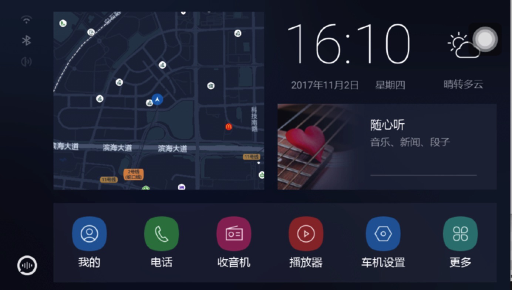

#### Welcome To Launcher GitHub
Lanucher is the interface of the first user graphical interaction of the Android terminal,is the start of the installation of other applications on the terminal entrance(Telephone, radio, and so on need to be connected to app).
#### Features
1. For the driving scene design, using lightweight, scientific sense of the UI design
2. The home page aggregated voice, maps, music and other entrances, the car scene is more convenient to use

#### Structure

- app-headunit-open: car launcher
- app-mirror-open: mirror launcher
- map-sdk: map sdk encapsulation
- core: core function library

#### Compile
- set the required Android environment
- compile car launcher: bash bash build-app-headunit-open.sh
- compile mirror launcher: bash build-app-mirror-open.sh
- The compilation will generate two release APK and debug in the output directory 
The debug version is used for debugging, and the release version closes the log

#### Running car launcher
- Install any DuerOS\_Launcher\_HU\_Open_*.apk by ADB install
Select the DuerOSLauncher as the main screen by pressing the home key, and display the following interface:

click the "more" in the lower right corner to show all the app installed on this car
- Run the rearview mirror launcher and run the car machine version launcher step the same, just change the APK to DuerOS\_Launcher\_Mirror_*.apk, the interface as the following picture:
