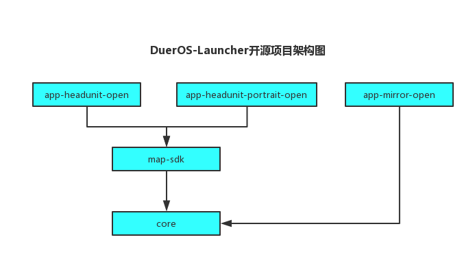
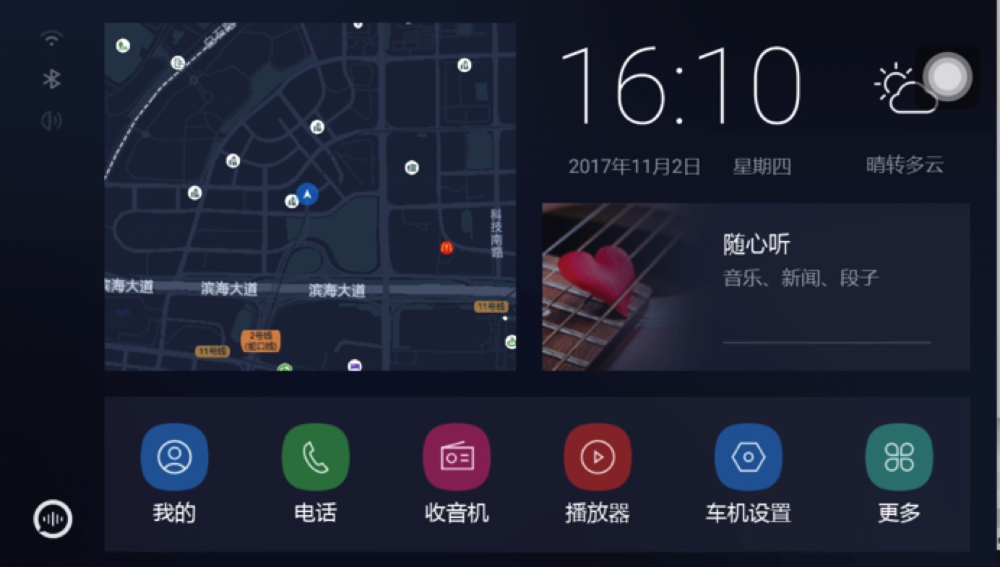
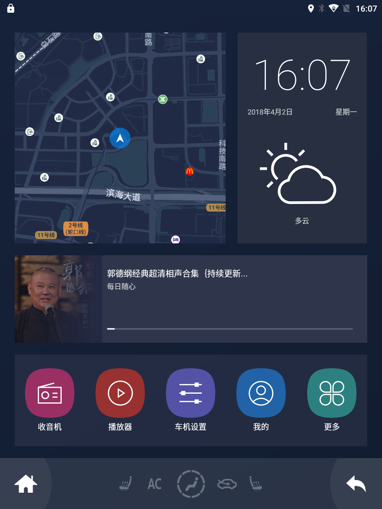
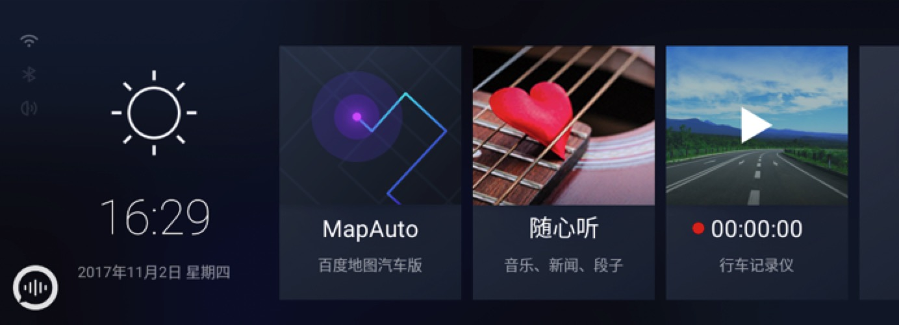

#### 欢迎来到 Launcher GitHub
Lanucher是android终端机上首个用户图形交互的界面，是启动安装在终端机上其他应用的入口(电话，收音机等app需自行接入)。
#### 本项目有如下特点
1. 针对驾驶场景设计，采用轻量化、科技感的UI设计
2. 主页聚合了语音，地图，音乐等入口，车载场景使用更加便捷

#### 项目构成

- app-headunit-open：横屏车机launcher
- app-headunit-portrait-open：竖屏车机launcher
- app-mirror-open：后视镜launcher
- map-sdk：地图sdk封装
- core：核心功能库

#### 编译
- 首先请搭建好所需的android环境
- 编译横屏车机launcher：bash build-app-headunit-open.sh
- 编译竖屏车机launcher：bash build-app-headunit-portrait-open.sh
- 编译后视镜launcher：bash build-app-mirror-open.sh
- 编译完成会在output目录下分别生成release和debug两个apk，
debug版本用于调试，release版本关闭了log

#### 运行车机版launcher
- 通过adb install 方式安装任意一款DuerOS\_Launcher\_HU\_Open_*.apk
按home键选DuerOSLauncher作为主屏幕，会展示如下界面：

点击右下角的“更多”，可以展示安装在此车机上所有的app
- 运行竖屏车机launcher和运行横屏车机launcher步骤相同，只需将apk换为DuerOS\_Launcher\_HU\_PT\_Open_*.apk，界面如下图：

- 运行后视镜launcher和运行车机版launcher步骤相同，只需将apk换为DuerOS\_Launcher\_Mirror_*.apk，界面如下图：
