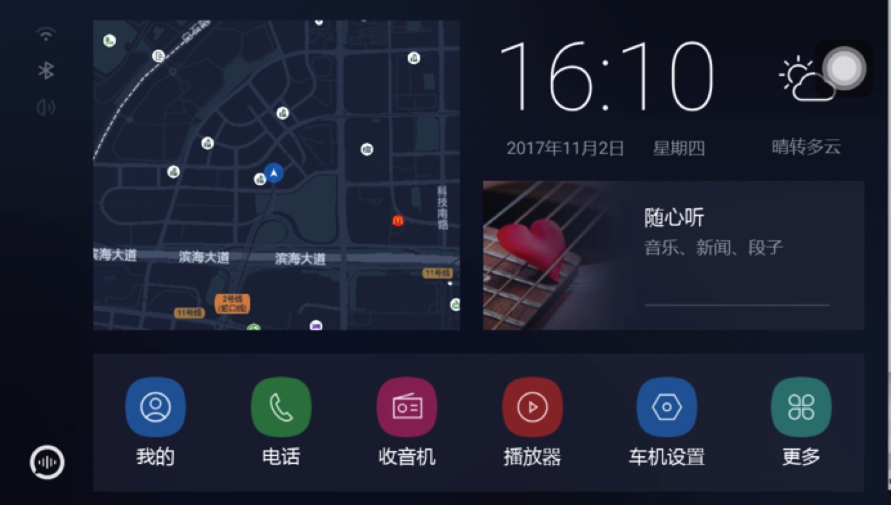

# Apollo-DuerOS
 Apollo-DuerOS is a set of telematics products associated with the Apollo , and there are several open source products at present.

##CarLife for Android Vehicle 

[CarLife for Android Vehicle](https://github.com/ApolloAuto/apollo-DuerOS/tree/master/CarLife-Android-Vehicle) is the implementation of the CarLife protocol on the Android platform.

[CarLife](http://carlife.baidu.com/)CarLife is a  mobilephone vehicle interconnected product, composed of mobilephone end and vehicle terminal.

The mobilephone and vehicle can be connected through the USB line to achieve screen projection and reverse control,  users can use the map, navigation, music and other driving services provided by the mobile phone on the vehicle.

All the business logic is on the mobilephone side，and the vehicle side  is primarily responsible for the functions of connection, protocol parsing, video decoding, audio playback and touch events.

CarLife mobilephone terminal support iOS and Android platform, vehicle terminal support Android, Linux, WINCE, QNX and other platforms.

##DuerOS Launcher
Lanucher is the interface of the first user graphical interaction of the Android terminal,is the start of the installation of other applications on the terminal entrance(Telephone, radio, and so on need to be connected to app).

###[DuerOS Launcher](https://github.com/ApolloAuto/apollo-DuerOS/tree/master/DuerOS-Launcher) Features:
1.For the driving scene design, using lightweight, scientific sense of the UI design
2.The home page aggregated voice, maps, music and other entrances, the car scene is more convenient to use
