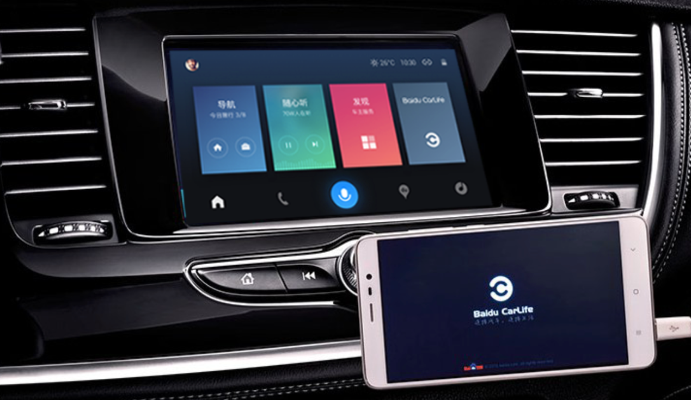

# Apollo-DuerOS
Apollo-DuerOS 是Apollo旗下车联网相关的产品，目前开放的产品有以下几个。

##CarLife Android车机端
[CarLife Android车机端](https://github.com/ApolloAuto/apollo-DuerOS/tree/master/CarLife-Android-Vehicle)是CarLife 车机端在Android平台上的实现。

[CarLife](http://carlife.baidu.com/)是一款手机车机互联的产品,由手机端和车机端组成。手机跟车机可以通过USB线进行连接，实现屏幕投射和反向控制，让用户在车机上使用手机提供的地图、导航、音乐等驾车服务。
所有的业务逻辑都在手机端，车机端主要只实现连接、协议解析、视频解码、音频播放和触摸事件等功能。
CarLife手机端支持iOS和Android平台，车机端支持Android、Linux、WINCE、QNX等平台。

##DuerOS Launcher

Lanucher是android终端机上首个用户图形交互的界面，是启动安装在终端机上其他应用的入口(电话，收音机等app需自行接入)。

###[DuerOS Launcher](https://github.com/ApolloAuto/apollo-DuerOS/tree/master/DuerOS-Launcher)有如下特点:
1.针对驾驶场景设计，采用轻量化、科技感的UI设计
2.主页聚合了语音，地图，音乐等入口，车载场景使用更加便捷

